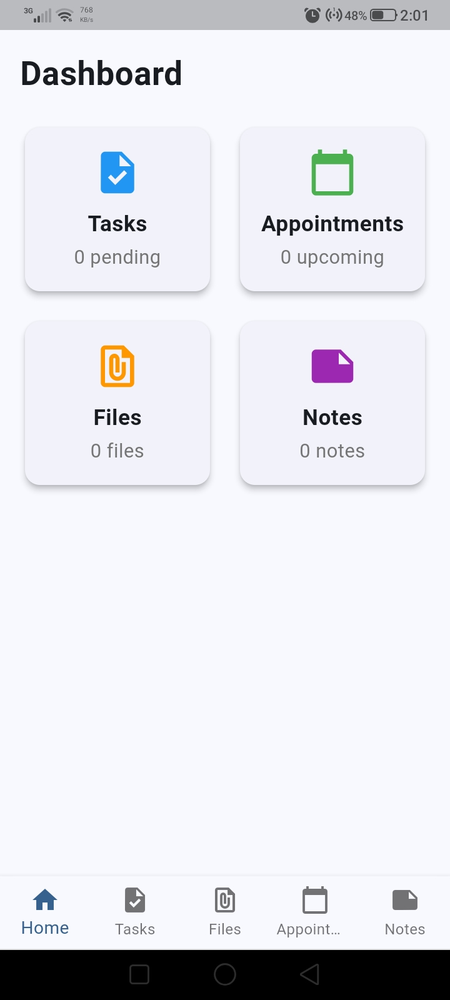
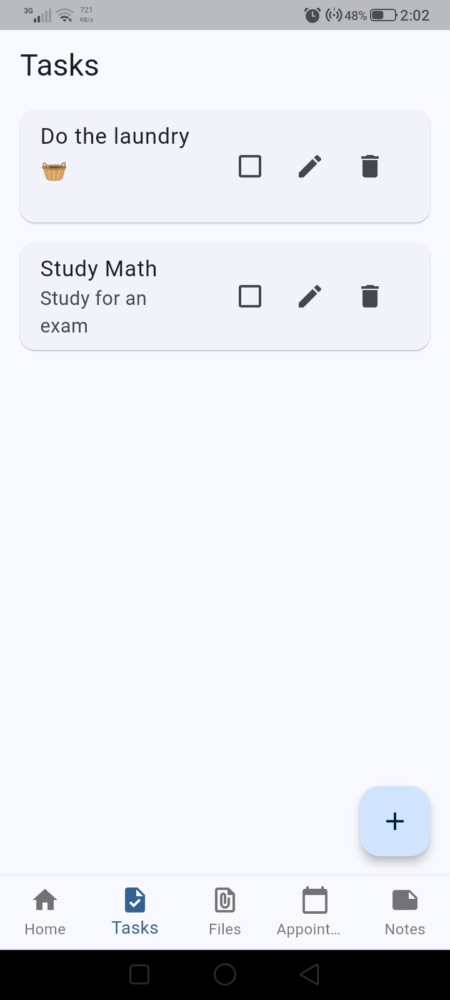
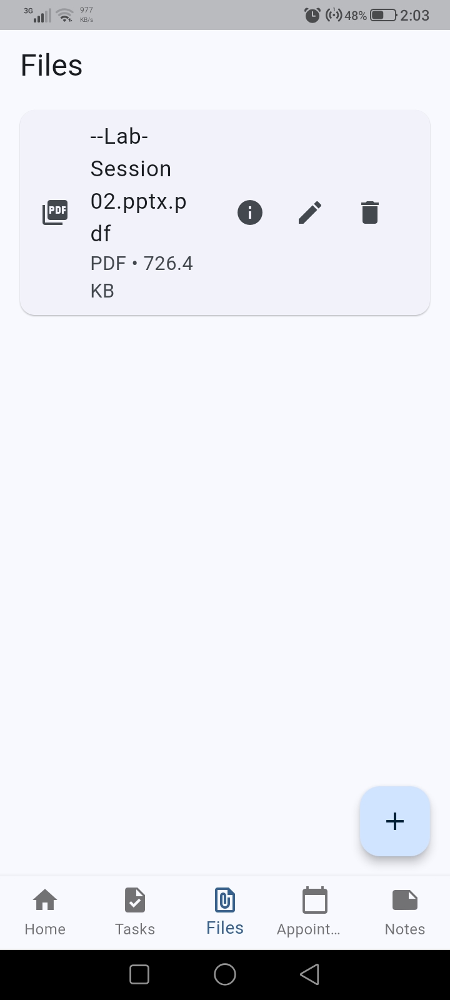
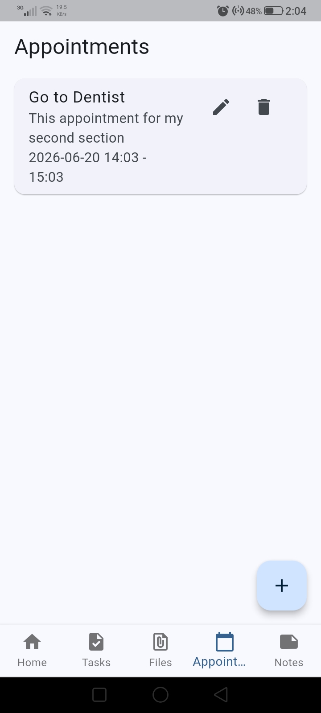
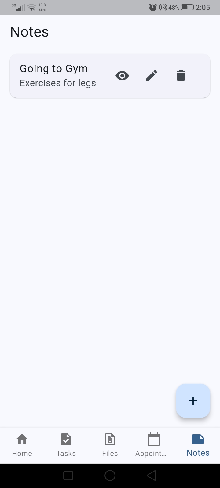

# ToDo List App

A comprehensive Flutter application for managing tasks, appointments, notes, and files with local storage and notification support.

## Features

### 🗂️ Task Management

- Create, edit, and delete tasks
- Mark tasks as completed or pending
- Set due dates for tasks
- View completed and pending tasks separately
- Persistent local storage

### 📅 Appointment Scheduling

- Schedule appointments with date and time
- Set start and end times
- Receive notifications for upcoming appointments
- View appointment details

### 📝 Note Taking

- Create and edit notes
- Rich text content support
- Timestamp tracking for creation and updates
- Organize notes with titles

### 📁 File Management

- Pick and store file references
- View file details (name, type, size)
- Open files with external applications
- File size formatting (B, KB, MB, GB)

### 🔔 Notifications

- Scheduled notifications for appointments
- Timezone-aware scheduling
- Cross-platform notification support (Android/iOS)

### 🎨 User Interface

- Material Design 3 with light/dark theme support
- Bottom navigation bar for easy access
- Responsive design for mobile devices
- Clean and intuitive user experience

## Screenshots

<h3>Screenshots</h3>











## Installation

### Prerequisites

- Flutter SDK (^3.9.2)
- Dart SDK
- Android Studio or VS Code with Flutter extensions

### Setup

1. Clone the repository:

   ```bash
   git clone <repository-url>
   cd todolist
   ```

2. Install dependencies:

   ```bash
   flutter pub get
   ```

3. Generate launcher icons:

   ```bash
   flutter pub run flutter_launcher_icons
   ```

4. Run the app:
   ```bash
   flutter run
   ```

## Project Structure

```
lib/
├── main.dart                 # App entry point with providers setup
├── models/                   # Data models
│   ├── task.dart            # Task model
│   ├── note.dart            # Note model
│   ├── appointment.dart     # Appointment model
│   └── file_item.dart       # File item model
├── providers/               # State management
│   ├── task_provider.dart   # Task state management
│   ├── note_provider.dart   # Note state management
│   ├── appointment_provider.dart  # Appointment state management
│   └── file_provider.dart   # File state management
├── screens/                 # UI screens
│   ├── home_screen.dart     # Main navigation screen
│   ├── home_dashboard.dart  # Dashboard overview
│   ├── task_screen.dart     # Task management screen
│   ├── note_screen.dart     # Note management screen
│   ├── appointment_screen.dart  # Appointment management screen
│   └── file_screen.dart     # File management screen
└── services/                # Business logic services
    ├── local_storage_service.dart  # SharedPreferences storage
    └── notification_service.dart   # Local notifications
```

## Dependencies

### Core Dependencies

- **provider**: State management solution
- **shared_preferences**: Local data persistence
- **intl**: Internationalization support

### File & Media

- **file_picker**: File selection functionality
- **open_file**: Open files with external apps
- **permission_handler**: Handle app permissions

### Notifications

- **flutter_local_notifications**: Local notification scheduling
- **timezone**: Timezone handling for notifications

### UI & Utils

- **cupertino_icons**: iOS style icons
- **flutter_launcher_icons**: App icon generation

## Architecture

The app follows the **MVVM (Model-View-ViewModel)** architecture pattern:

- **Models**: Define data structures (Task, Note, Appointment, FileItem)
- **Providers**: Handle business logic and state management using Provider pattern
- **Screens**: UI components that consume provider data
- **Services**: Handle external operations (storage, notifications)

### State Management

The app uses the Provider package for state management:

- Each feature has its own provider (TaskProvider, NoteProvider, etc.)
- Providers handle CRUD operations and notify listeners of state changes
- Data persistence is handled through LocalStorageService

### Data Persistence

- Uses SharedPreferences for local storage
- Data is serialized to JSON for storage
- Automatic loading on app startup

## Permissions

The app requires the following permissions:

- **Storage**: For file picking and management
- **Notifications**: For appointment reminders

## Building for Production

### Android

```bash
flutter build apk --release
```

### iOS

```bash
flutter build ios --release
```

### Web

```bash
flutter build web --release
```

### Version 1.0.0

- Initial release
- Task management functionality
- Note taking features
- Appointment scheduling with notifications
- File management system
- Local storage implementation
- Material Design 3 UI
